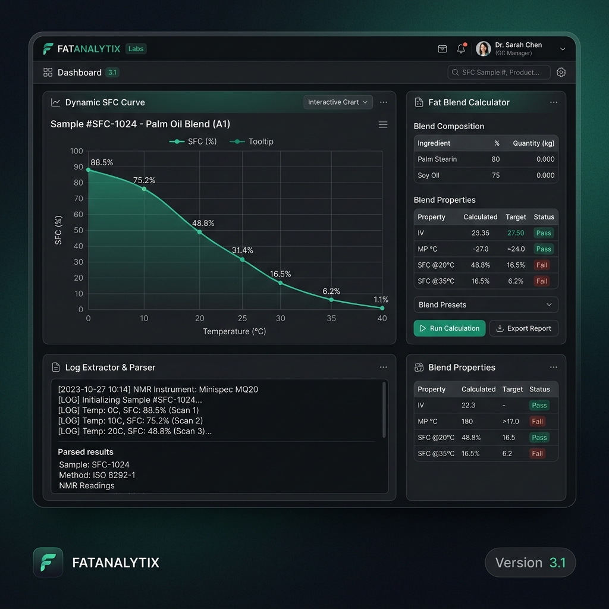
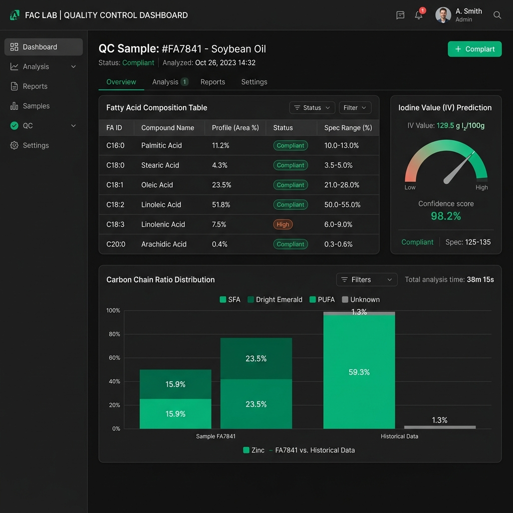
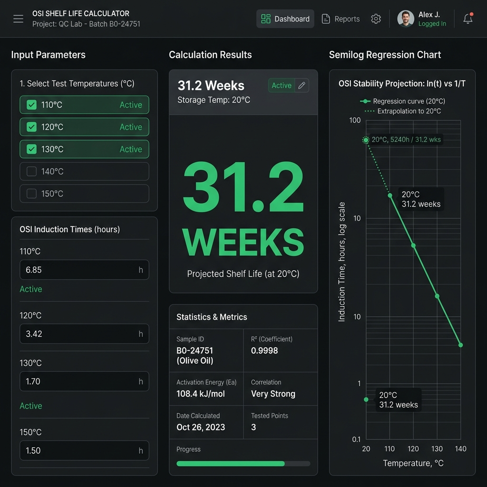
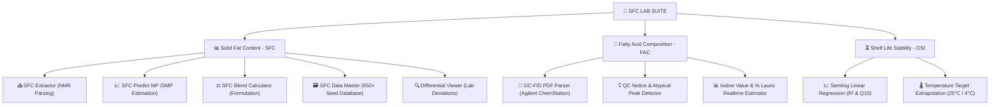

# 🧪 SFC LAB SUITE — QC Instrument Tools

[](https://github.com/ardianrifendy/SFC-LAB-Suite)
[](LICENSE)
[](sfc-lab-suite.html)
[](sfc-lab-suite.html)

Welcome to **SFC LAB SUITE (QC Instrument Tools)** — an enterprise-grade, high-performance analytical suite built for Quality Control (QC), R&D, and Quality Assurance (QA) in the edible oils and fats industry.

The platform unifies **Solid Fat Content (SFC)** Bruker/NMR log extraction, Slip Melting Point (SMP) trend prediction, multi-component fat blending simulation, GC-FID **Fatty Acid Composition (FAC)** smart parsing, and **OSI (Oil Stability Index) Shelf Life Projection** into a single, offline-first web application.

---

## 📸 Interactive Module Previews

| SFC Analytical Suite | FAC GC-FID Extractor | OSI Shelf Life Calculator |
| :---: | :---: | :---: |
|  |  |  |

---

## ⚡ Key Modules & Analytical Capabilities



### 1. 📥 SFC Value Extractor
* **Automatic Bruker/NMR Log Parsing**: Instantly converts raw, unstructured NMR text reports into structured tabular datasets.
* **Dual Parsing Modes**: Supports **Sample Definition (A)** for daily routine QC samples and **Sample Archive (B)** for massive historical batch extractions.
* **Instant Column Copying**: Click any column header to copy an entire column directly to Excel/TSV format.

### 2. 📈 SFC Predict MP (Trend Analysis)
* **Interactive SFC Curve Plotting**: Plots multi-temperature SFC curves with real-time Chart.js rendering.
* **Dual Temperature Ranges**: Mode 1 (2.5°C – 20°C) for soft fats/shortenings and Mode 2 (10°C – 60°C) for hard fats/stearins.
* **Slip Melting Point (SMP) Estimation**: Automatically calculates the exact temperature intersection at 5% SFC using linear interpolation (`Calc.meltingPoint`).

### 3. ⚖️ SFC Blend Calculator
* **Multi-Component Formulation**: Simulates SFC profile curves for complex fat blends (e.g., 60% Palm Oil + 40% Soft Stearin).
* **Reference Profiles Integration**: Dynamically pulls baseline profiles from the 650+ record reference database.
* **100% Ratio Validation**: Ensures strict mathematical precision across all temperature points (T10 – T65).

### 4. 🗃️ SFC Data Master
* **650+ Built-in Reference Seed**: Includes pre-loaded historical laboratory records for PO, PKO, ST, Olein, and Hydrogenated fats.
* **Instant Filter Chips**: One-click filtering by fat matrix category.
* **Manual Reference Overrides**: Customize reference values with instant visual indicators (orange indicators for modified baselines).
* **Backup & Restore**: Export/Import complete database backups via standard CSV files.

### 5. 🔍 Differential Viewer (SFC Compare)
* **Theoretical vs. Actual Deviation**: Highlights differences between predicted blend formulas and laboratory trials.
* **Color-Coded Tolerance Levels**:
  * 🟢 **Green (Precision)**: ≤ 2% deviation.
  * 🟡 **Yellow (Warning)**: ≤ 5% deviation.
  * 🔴 **Red (Out of Spec)**: > 5% deviation.

### 6. 🧪 FAC Smart Extractor (GC-FID Analysis)
* **Agilent ChemStation PDF Parser**: Parses multi-page GC-FID PDF reports via PDF.js.
* **Automatic QC Notice Generator**: Detects atypical peaks (C11:0, C13:0, C15:0, C17:0, Trans isomers) in Palm Oil matrices and presents scientific explanations (e.g. Ruminant Fat / Column Bleed).
* **Slow Pulse Highlight**: Flagged QC rows pulse gently with an amber glow (`animate-qc-highlight`) to guide operator focus.
* **Real-time Iodine Value (IV) & % Lauric Calculation**: Automatically computes calculated Iodine Value and Lauric acid content.

### 7. ⏳ OSI Shelf Life Calculator
* **Semilog Linear Regression**: Extrapolates high-temperature Rancimat/OSI Induction Times to storage temperatures (25°C room temp or 4°C chiller).
* **Reliability Evaluation**: Evaluates regression linearity R² (≥ 0.98 for high reliability) and computes temperature coefficient Q10.
* **Interactive Chart & Breakdown**: Visualizes regression curves and displays projected shelf life in Years, Months, and Days.

---

## ⌨️ Interactive Keyboard Shortcuts & UI Features

| Action | Shortcut / Trigger | Description |
| :--- | :--- | :--- |
| **Copy Column Data** | Click Column Header | Copies 1 column of data directly to clipboard in TSV format. |
| **Copy Entire Table** | Click `📋 Salin Tabel (TSV)` | Copies whole active table to paste directly into Microsoft Excel. |
| **Interactive Help** | Click `📖 Petunjuk` in Header | Opens rich, step-by-step interactive guide modal for the active module. |
| **Toggle Theme** | Click Theme Toggle `☀️/🌙/🖥️` | Cycles between Light Mode, Zinc Dark Mode, and System Auto Mode. |
| **Quick Scroll to Top**| Click Floating Arrow Button | Smoothly scrolls long tables back to the top. |
| **Toast Notifications**| Center Bottom Pop-up | Displays non-intrusive status updates at the bottom center of the screen. |

---

## 💻 Developer & Build Workflow

The suite is engineered as a **self-contained single HTML bundle** for effortless offline deployment.

### File Structure
```
SFC-TOOLS/
├── sfc-lab-suite.html          # Main standalone production bundle
├── README.md                   # Documentation
├── data_master_seed.csv        # Baseline seed CSV dataset (650+ records)
├── images/                     # Screenshot previews
└── scratch/
    ├── sfc-lab-suite-shell.html # HTML shell and styling layout
    ├── app-logic.js             # Core engine, calculations, & UI handlers
    ├── generate_suite.js        # Build compiler script
    └── test_runner.js           # Headless Node.js DOM validator
```

### Rebuilding the Suite
If you modify `sfc-lab-suite-shell.html`, `app-logic.js`, or `data_master_seed.csv`, run the build compiler to generate the updated production bundle:

```bash
# 1. Compile single HTML bundle
node scratch/generate_suite.js

# 2. Run headless validation suite
node scratch/test_runner.js
```

---

## 📄 License

Distributed under the **MIT License**. See `LICENSE` for details.

Developed with ❤️ for Edible Oils & Fats QC Analytics.
